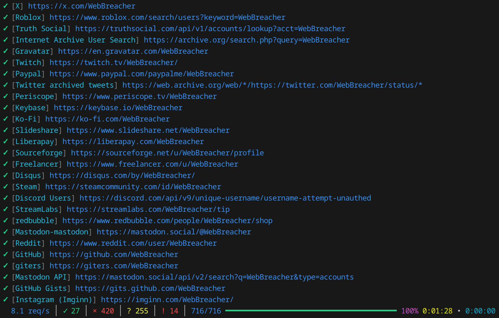

# Naminter

[](https://www.python.org/downloads/)
[](LICENSE)
[](https://github.com/3xp0rt/naminter)
[](https://pypi.org/project/naminter/)
[](https://pypi.org/project/naminter/)

Naminter is a Python package and command-line interface (CLI) tool for asynchronous OSINT username enumeration using the WhatsMyName dataset. Leveraging the comprehensive [WhatsMyName](https://github.com/WebBreacher/WhatsMyName) list, Naminter enumerates usernames across hundreds of websites. With advanced features like browser impersonation, asynchronous enumeration, and customizable filtering, it can be used both as a command-line tool and as a library in your Python projects.

<p align="center">

</p>

## Table of Contents

- [Installation](#installation)
  - [From PyPI](#from-pypi)
  - [From Source](#from-source)
  - [From Docker](#using-docker)
- [Usage](#usage)
  - [Basic CLI Usage](#basic-cli-usage)
  - [Advanced CLI Options](#advanced-cli-options)
  - [Using as a Python Package](#using-as-a-python-package)
- [Command Line Options](#command-line-options)
- [Contributing](#contributing)
- [License](#license)

## Installation

### From PyPI

Install Naminter with pip:

```bash
pip install naminter
```

### From Source

Clone the repository and install in editable mode:

```bash
git clone https://github.com/3xp0rt/naminter.git
cd naminter
pip install -e .
```

### Using Docker

All needed folders are mounted on the first start of the docker compose run command.

```bash
# Using the prebuilt docker image from the GitHub registry
docker run --rm -it ghcr.io/3xp0rt/naminter --username john_doe

# Build the docker from the source yourself
git clone https://github.com/3xp0rt/naminter.git && cd naminter
docker build -t naminter .
docker compose run --rm naminter --username john_doe
```

## Usage

### Basic CLI Usage

Enumerate a single username:

```bash
naminter --username john_doe
```

Enumerate multiple usernames:

```bash
naminter --username user1 --username user2 --username user3
```

### Advanced CLI Options

Customize the enumerator with various command-line arguments:

```bash
# Basic username enumeration with custom settings
naminter --username john_doe \
    --max-tasks 100 \
    --timeout 15 \
    --impersonate chrome \
    --include-categories social coding

# Using proxy and saving responses
naminter --username jane_smith \
    --proxy http://proxy:8080 \
    --save-response \
    --open-response

# Using custom schema validation
naminter --username alice_bob \
    --local-schema ./custom-schema.json \
    --local-list ./my-sites.json

# Using remote schema with custom list
naminter --username test_user \
    --remote-schema https://example.com/custom-schema.json \
    --remote-list https://example.com/my-sites.json

# Export results in multiple formats
naminter --username alice_bob \
    --csv \
    --json \
    --html \
    --filter-all

# Export with custom paths using merged flags
naminter --username alice_bob \
    --csv results.csv \
    --json results.json \
    --html report.html

# Site validation with detailed output
naminter --test \
    --show-details \
    --log-level DEBUG \
    --log-file debug.log
```

### Using as a Python Package

Naminter can be used programmatically in Python projects to enumerate usernames across various platforms.

#### Basic Example

```python
import asyncio
from naminter import Naminter, CurlCFFISession, WMN_REMOTE_URL

async def main():
    async with CurlCFFISession() as http_client:
        wmn_data = (await http_client.get(WMN_REMOTE_URL)).json()

        async with Naminter(http_client=http_client, wmn_data=wmn_data) as naminter:
            async for result in naminter.enumerate_usernames(["example_username"]):
                if result.status.value == "exists":
                    print(f"✅ {result.username} found on {result.name}: {result.url}")
                elif result.status.value == "missing":
                    print(f"❌ {result.username} not found on {result.name}")
                elif result.status.value == "error":
                    print(f"⚠️ Error checking {result.username} on {result.name}: {result.error}")

asyncio.run(main())
```


#### Advanced Configuration

```python
import asyncio
from naminter import Naminter, CurlCFFISession, WMNMode, WMN_REMOTE_URL

async def main():
    async with CurlCFFISession(
        timeout=15,
        impersonate="chrome",
        verify=True,
        proxies="http://proxy:8080"
    ) as http_client:
        wmn_data = (await http_client.get(WMN_REMOTE_URL)).json()

        async with Naminter(
            http_client=http_client,
            wmn_data=wmn_data,
            max_tasks=100
        ) as naminter:
            usernames = ["user1", "user2", "user3"]
            async for result in naminter.enumerate_usernames(usernames, mode=WMNMode.ANY):
                if result.status.value == "exists":
                    print(f"✅ {result.username} on {result.name}: {result.url}")

asyncio.run(main())
```

#### Site Validation

```python
import asyncio
from naminter import Naminter, CurlCFFISession, WMN_REMOTE_URL

async def main():
    async with CurlCFFISession() as http_client:
        wmn_data = (await http_client.get(WMN_REMOTE_URL)).json()

        async with Naminter(http_client=http_client, wmn_data=wmn_data) as naminter:
            async for site_result in naminter.enumerate_test():
                if site_result.error:
                    print(f"❌ {site_result.name}: {site_result.error}")
                else:
                    found = sum(1 for r in site_result.results if r.status.value == "exists")
                    total = len(site_result.results)
                    print(f"✅ {site_result.name}: {found}/{total} known accounts found")

asyncio.run(main())
```

#### Getting WMN Summary

```python
import asyncio
from naminter import Naminter, CurlCFFISession, WMN_REMOTE_URL, WMN_SCHEMA_URL

async def main():
    async with CurlCFFISession() as http_client:
        # Load data and (optionally) schema using public constants
        wmn_data = (await http_client.get(WMN_REMOTE_URL)).json()
        wmn_schema = (await http_client.get(WMN_SCHEMA_URL)).json()

        async with Naminter(
            http_client=http_client,
            wmn_data=wmn_data,
            wmn_schema=wmn_schema,
        ) as naminter:
            summary = naminter.get_wmn_summary()
            print(f"Total sites: {summary.sites_count}")
            print(f"Total categories: {summary.categories_count}")
            print(f"Known accounts: {summary.known_count}")

asyncio.run(main())
```

## Command Line Options

### Basic Usage
| Option                      | Description                                                |
|-----------------------------|------------------------------------------------------------|
| `--username, -u`            | Username(s) to search                                      |
| `--site, -s`                | Specific site name(s) to enumerate                         |
| `--version`                 | Show version information                                   |
| `--no-color`                | Disable colored output                                     |
| `--no-progressbar`          | Disable progress bar display                               |

### Input Lists
| Option                      | Description                                                |
|-----------------------------|------------------------------------------------------------|
| `--local-list`              | Path to a local file containing the list of sites to enumerate |
| `--remote-list`             | URL to fetch a remote list of sites to enumerate           |
| `--skip-validation`         | Skip WhatsMyName schema validation for lists               |
| `--local-schema`            | Path to local WhatsMyName schema file                      |
| `--remote-schema`           | URL to fetch custom WhatsMyName schema                     |

### Site Validation
| Option                      | Description                                                |
|-----------------------------|------------------------------------------------------------|
| `--test`                    | Validate site detection methods by checking known usernames |

### Category Filters
| Option                      | Description                                                |
|-----------------------------|------------------------------------------------------------|
| `--include-categories`      | Categories of sites to include in the search               |
| `--exclude-categories`      | Categories of sites to exclude from the search             |

### Network Options
| Option                      | Description                                                |
|-----------------------------|------------------------------------------------------------|
| `--proxy`                   | Proxy server to use for requests                           |
| `--timeout`                 | Maximum time in seconds to wait for each request (default: 30) |
| `--allow-redirects`         | Whether to follow URL redirects                             |
| `--verify-ssl`              | Whether to verify SSL certificates                          |
| `--impersonate, -i`         | Browser to impersonate in requests (chrome, chrome_android, safari, safari_ios, edge, firefox) |

### Concurrency & Debug
| Option                      | Description                                                |
|-----------------------------|------------------------------------------------------------|
| `--max-tasks`               | Maximum number of concurrent tasks (default: 50)           |
| `--mode`                    | Validation mode: `all` for strict matching (all detection criteria must match) or `any` for permissive matching (at least one detection criterion must match) |
| `--log-level`               | Set logging level (DEBUG, INFO, WARNING, ERROR, CRITICAL)  |
| `--log-file`                | Path to log file for debug output                          |
| `--show-details`            | Show detailed information in console output                 |
| `--browse`                  | Open found profiles in web browser                         |

### Response Handling
| Option                      | Description                                                |
|-----------------------------|------------------------------------------------------------|
| `--save-response [DIR]`     | Save HTTP response body; optionally specify directory      |
| `--open-response`           | Open saved response file in browser                        |

### Export Options
| Option        | Description |
|---------------|-------------|
| `--csv [PATH]`  | Export results to CSV; optionally specify output path |
| `--pdf [PATH]`  | Export results to PDF; optionally specify output path |
| `--html [PATH]` | Export results to HTML; optionally specify output path |
| `--json [PATH]` | Export results to JSON; optionally specify output path |

### Result Filters
| Option                      | Description                                                |
|-----------------------------|------------------------------------------------------------|
| `--filter-all`              | Include all results in console and exports                 |
| `--filter-exists`            | Show only existing username results in console and exports |
| `--filter-partial`          | Show only partial match results in console and exports     |
| `--filter-conflicting`      | Show only conflicting results in console and exports        |
| `--filter-unknown`          | Show only unknown results in console and exports           |
| `--filter-missing`          | Show only missing username results in console and exports |
| `--filter-not-valid`        | Show only not valid results in console and exports         |
| `--filter-errors`           | Show only error results in console and exports             |


## Contributing

Contributions are always welcome! Please submit a pull request with your improvements or open an issue to discuss.

## License

This project is licensed under the MIT License - see the [LICENSE](LICENSE) file for details.
